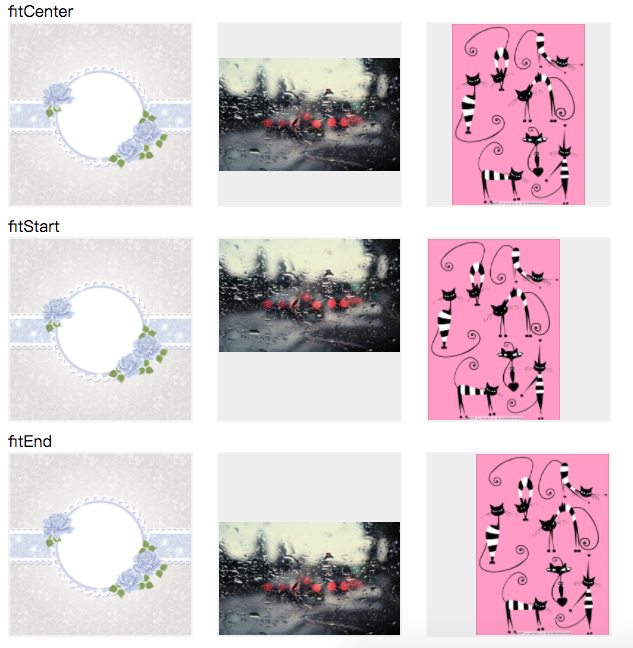
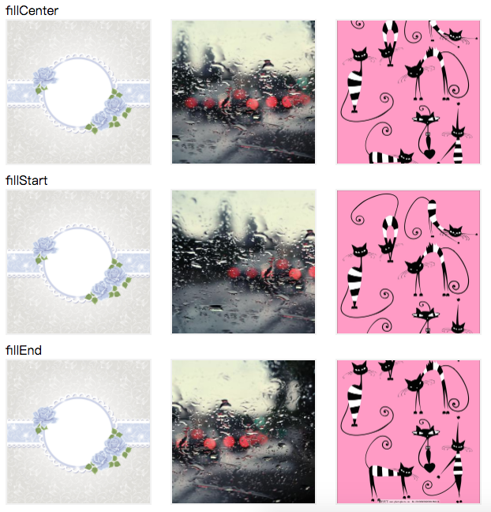

# jsImageScaleMode
js lib that support image different scale show mode

```
   fitStart     居左/上显示全部内容，宽或高顶满
   fitEnd       居右/下显示全部内容，宽或高顶满
   fitCenter:   居中显示全部内容，宽或高顶满
   fillStart:   图像start部分填满容器，多余部分剪裁
   fillEnd:     图像end部分填满容器，多余部分剪裁
   fillCenter:  图像center部分填满容器，多余部分剪裁
```

Fit模式示意图：



Fill模式示意图：

